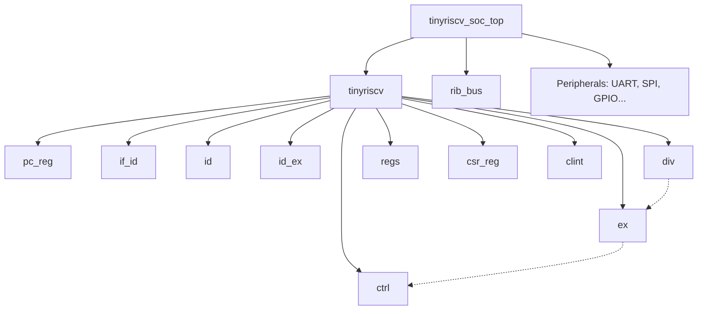

# tinyriscv RISC-V Core Analysis Skill

This document provides a structural overview and technical analysis of the `tinyriscv` project to streamline future deep-dives.

## 1. Project Overview
- **Architecture**: RISC-V 32-bit (RV32IM)
- **Pipeline Depth**: 3-stage (IF -> ID -> EX)
- **Bus Architecture**: RIB (RISC-V Internal Bus) - a custom, simple point-to-point / shared bus logic.
- **Privilege Modes**: Machine Mode (support for some CSRs and interrupts).

## 2. File Structure

### Core Logic (`core/`)
- [tinyriscv.v](core/tinyriscv.v): Top-level module of the CPU core, instantiates all sub-modules.
- [pc_reg.v](core/pc_reg.v): Program Counter register logic.
- [if_id.v](core/if_id.v): Pipeline register between Instruction Fetch and Decode.
- [id.v](core/id.v): Instruction Decode unit (combinatorial).
- [id_ex.v](core/id_ex.v): Pipeline register between Decode and Execute.
- [ex.v](core/ex.v): Execution unit (ALU, Branch, Load/Store address calculation, Multiplier).
- [div.v](core/div.v): Iterative hardware divider (restoring division method).
- [ctrl.v](core/ctrl.v): Centralized pipeline control (stall and jump logic).
- [regs.v](core/regs.v): General-purpose register file (32 x 32-bit).
- [csr_reg.v](core/csr_reg.v): Control and Status Registers (CSR) implementation.
- [clint.v](core/clint.v): Core Local Interrupt Controller (handles timers and software interrupts).
- [rib.v](core/rib.v): Bus arbiter and multiplexer logic for the RIB bus.
- [defines.v](core/defines.v): Global macro definitions (opcodes, bus widths, constants).

### Peripherals (`perips/`)
- `ram.v`, `rom.v`: Simple memory modules.
- `uart.v`, `spi.v`, `gpio.v`, `timer.v`: Standard I/O peripherals.

### SoC Top (`soc/`)
- [tinyriscv_soc_top.v](soc/tinyriscv_soc_top.v): Integrates the core with peripherals and memory.

### Utilities (`ref/rtl_tinyriscv/utils/`)
- `gen_dff.v`, `gen_buf.v`: Common hardware building blocks (registers with reset/enable).
- `full_handshake_tx/rx.v`: Handshaking modules for cross-clock domain or flow control.

## 3. Module Hierarchy (High Level)

## 4. Key Mechanisms & Implementation Notes

### Pipeline Stalling
- Controlled by `ctrl.v`. 
- Stall signals can be triggered by:
  - **EX stage**: Division operations (`div_hold_flag`).
  - **RIB bus**: Slow memory/peripheral access.
  - **CLINT**: Interrupt handling.
  - **JTAG**: Debugger halt request.
- The stall priority and scope are defined in `ctrl.v`. Usually, a stall in EX freezes IF, ID, and EX stages.

### M-Extension Support (Multiplication/Division)
- **Multiplication**: 
    - Implemented **combinatorially** in `ex.v` using the `*` operator.
    - Result is available in a single cycle (in the EX stage).
    - No pipeline stall required.
- **Division/Remainder**:
    - Implemented **iteratively** in `div.v`.
    - Takes at least **33 clock cycles**.
    - **Pipeline Stall**: The EX stage asserts a hold signal that stalls the entire pipeline until `div` asserts `ready_o`.
    - Instruction is held in EX, and results are written back once finished, maintaining in-order completion.

### Memory Access
- Two separate RIB bus masters in the core:
    1. **Instruction Fetch (IF)**: Accesses ROM/RAM for instructions.
    2. **Data Access (EX)**: Accesses RAM/Peripherals for Load/Store instructions.
- Arbitration and routing are handled by `rib.v` in the SoC level.

### Interrupts
- Supported via `clint.v` and `csr_reg.v`.
- When an interrupt is asserted, `clint.v` signals `ex.v` to perform a jump to the trap handler address.
- `mstatus`, `mepc`, `mtvec` CSRs are used for state management.

### CSR Support (Control and Status Registers)
- **Supported Instructions**: Decoded in `id.v` and executed in `ex.v` (combinatorial, single-cycle).
  - Register-operand: `csrrw`, `csrrs`, `csrrc`
  - Immediate-operand: `csrrwi`, `csrrsi`, `csrrci`
- **Supported CSR Registers** (`csr_reg.v`):
  - **Performance Counters**: `cycle` (0xC00), `cycleh` (0xC80)
  - **Machine Mode Trap Setup/Handling**: `mstatus` (0x300), `mie` (0x304), `mtvec` (0x305), `mscratch` (0x340), `mepc` (0x341), `mcause` (0x342)
- **Dual-Port Access**: `csr_reg.v` exposes ports to both the execution unit (`ex.v`) and Core Local Interrupt Controller (`clint.v`). CPU instructions (`ex.v`) have higher write priority than `clint.v` interrupts.

## 5. Usage for Future Analysis
- To analyze **data hazards**: Focus on `id.v` (operands) and `ex.v` (result). Note that since it's a 3-stage pipeline with immediate WB in EX, data hazard management might be simpler (or require forwarding from EX to ID).
- To analyze **bus transactions**: Look at `rib.v` and how `ex.v` drives `mem_req_o`.
- To analyze **branching**: Check `ex.v` for `jump_flag_o` and how it interacts with `ctrl.v`.
