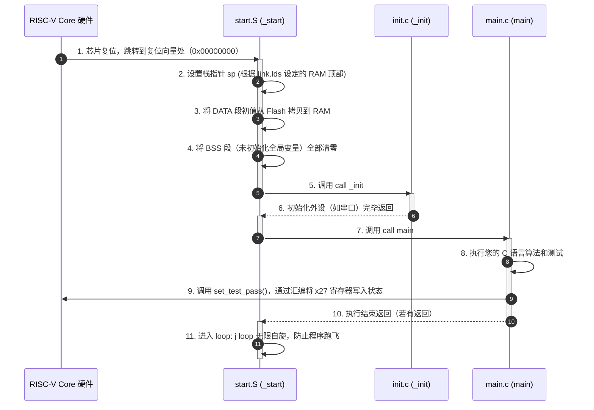
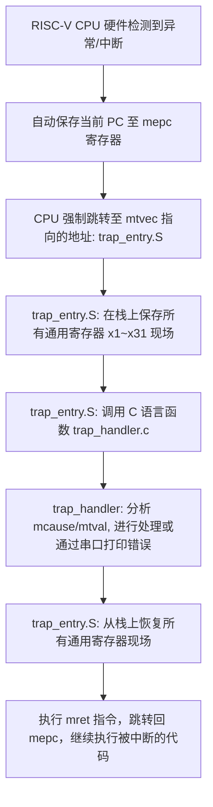

# RISC-V 裸机测试程序编译与适配指南

本目录（`tests/programs`）是专为您自己设计的 RISC-V 处理器核定制的、**自包含、免安装**的裸机程序编译与机器码生成环境。它可以将 C/汇编源码编译为能够被您的 RV 核直接加载运行的纯二进制机器码（`.bin`），并提供了丰富的外设打印驱动和反汇编分析工具。

---

## 0. 快捷使用
1. 配置好各处 Makefile 后执行 `make`，生成用于处理器运行的 `.bin` 和用于调试参考的 `.dump`。
2. 执行 `make data`，调用 `tools/scripts/BinToMem_CLI.py` 将 `.bin` 转换为 testbench 可读取的 `.data`。
3. 执行 `make rename`，调用 `tools/scripts/rename_regs.py` 将 `.dump` 中的 ABI 寄存器名转换为 `x0`~`x31`，输出 `.dump.rename`。
4. 执行 `make clean` 只删除 ELF 和中间目标文件，保留 `.bin`、`.dump`、`.data` 和 `.dump.rename`；执行 `make clean_all` 删除全部构建产物。

## 一、 目录结构与文件角色

为实现与原参考项目解耦，本目录已重构为非常规整的**对称结构**。所有的通用底层文件均作为 `common` 的子目录管理：

```
tests/programs/
├── common/                     # 通用底层基础设施
│   ├── common.mk               # 核心编译规则“总指挥” (已配置适配您工作区下的本地工具链)
│   ├── link.lds                # 链接脚本，规定 RAM/Flash 的地址分配 (空间规划师)
│   ├── start.S                 # 上电复位启动汇编，搭建栈环境、拷贝数据段并调用 main
│   ├── init.c                  # 系统基础硬件初始化
│   ├── trap_entry.S            # 中断与异常处理入口汇编 (保护现场与恢复现场)
│   ├── trap_handler.c          # 中断与异常具体处理逻辑 (C 语言实现)
│   ├── include/                # 精炼的驱动头文件
│   │   ├── utils.h             # 仿真结束宏、内联汇编辅助工具
│   │   ├── uart.h              # 串口寄存器映射
│   │   ├── xprintf.h           # 轻量化 printf 库声明
│   │   └── ... (timer.h, gpio.h, spi.h)
│   └── lib/                    # 底层驱动源文件
│       ├── uart.c              # 串口发送/接收/初始化驱动
│       ├── xprintf.c           # 移植的迷你 printf 打印库 (支持格式化输出)
│       └── utils.c             # 辅助工具函数
├── simple/                     # 具体测试程序示例 (可复制此文件夹创建新测试)
│   ├── Makefile                # 声明目标名(simple)、源码文件，并引入 common.mk
│   └── main.c                  # 具体的测试逻辑 (加减乘除与状态输出)
└── README.md                   # 本技术文档
```

---

## 二、 底层调用与执行关系

理解软硬件交互流程，是成功适配和调试 RISC-V 核的基础：

### 1. 正常启动与运行流程


### 2. 中断与异常处理流程
当处理器内部出错（如除零、非法指令）或外部触发中断时，处理逻辑如下：


---

## 三、 适配您自己的 RISC-V 核需修改的参数

当您用这个环境来为您自己编写的 RISC-V 核编译程序时，您可能需要根据自己核的**硬件特性**修改以下参数：

### 1. 编译器指令集选项（若您的核不支持乘除法）
在 `simple/Makefile`（或您新建的其他测试程序的 `Makefile`）中：
```makefile
RISCV_ARCH := rv32im   # 默认为 RV32I + M(乘除法扩展)
RISCV_ABI := ilp32
```
> **修改建议**：如果您的 RISC-V 核心是**纯基准的 RV32I 核心**（不支持硬件乘除法，乘除法由编译器软件模拟），请务必将其修改为：
> `RISCV_ARCH := rv32i`

### 2. 内存版图与首指令地址（在 `common/link.lds` 中）
芯片上电后首条指令的读取地址（复位向量）必须与您的核硬件设计的 Boot 地址完全一致：
```linker
MEMORY
{
  flash (wxa!ri) : ORIGIN = 0x00000000, LENGTH = 16K   # 只读指令区 (ROM/Flash) 起始地址与大小
  ram (wxa!ri) :   ORIGIN = 0x10000000, LENGTH = 16K   # 读写数据区 (RAM) 起始地址与大小
}
```
> **修改建议**：
> *   如果您的 CPU 内部的指令存储器（Instruction Memory）基地址是 `0x80000000`，请将 `flash` 的 `ORIGIN` 改为 `0x80000000`。
> *   如果您的数据存储器（Data Memory）基地址是 `0x90000000`，请将 `ram` 的 `ORIGIN` 改为 `0x90000000`。
> *   您可以自由修改 `LENGTH` 限制，编译器在链接时如果发现代码超重会自动发出警告。

### 3. 仿真退出与状态标志（在 `common/include/utils.h` 中）
仿真环境中（如 ModelSim, Verilator），CPU 执行完毕后如何优雅地告诉 Testbench“测试已通过”？
原本的参考程序是通过内联汇编**改写 RISC-V 寄存器 `x27`**，由仿真平台去监测 `x27` 的数值来判断的：
```c
#define set_test_pass() asm("li x27, 0x01")  // 测试通过：把 x27 寄存器写为 1
#define set_test_fail() asm("li x27, 0x02")  // 测试失败：把 x27 寄存器写为 2
```
> **修改建议**：
> *   如果您自己的 Testbench 监测的是别的寄存器（比如 `x26`），可以直接修改这里的寄存器名。
> *   如果您的 CPU 仿真采用的是**“写特定外设物理地址退出”**（例如向 `0x30000008` 写入 `0x01` 表示成功退出），您可将宏定义改为：
>     ```c
>     #define set_test_pass() do { *(volatile uint32_t *)(0x30000008) = 0x01; } while(0)
>     #define set_test_fail() do { *(volatile uint32_t *)(0x30000008) = 0x02; } while(0)
>     ```

### 4. 关键编译宏 SIMULATION 的控制机制（在 Makefile 中）

在 `simple/Makefile` 中，有以下一行默认配置：
```makefile
CFLAGS += -DSIMULATION
```
这个宏不仅在编译 C 语言代码时会传给 GCC，在编译汇编文件时同样会生效。它直接改变并控制了以下三大核心代码逻辑，**使软件代码能够与您的 Verilog/SystemVerilog RTL 仿真环境（Testbench）完美协同工作**：

#### (1) start.S（启动仿真环境的握手与自动退出）
*   **上电复位阶段**（Line 13-16）：
    ```assembly
    #ifdef SIMULATION
        li x26, 0x00
        li x27, 0x00
    #endif
    ```
    一旦检测到仿真宏，启动汇编会立即将寄存器 `x26`（仿真结束标志）和 `x27`（成功与否状态）清空。
*   **正常执行完毕阶段**（Line 44-46）：
    ```assembly
    #ifdef SIMULATION
        li x26, 0x01
    #endif
    ```
    当主程序 `main()` 正常运行完毕并返回时，启动汇编会强行往 `x26` 写入 `0x01`。您的 Verilog Testbench 可以实时监测 CPU 的 `x26` 寄存器数值。一旦发现 `x26 == 1`，Testbench 就会知道软件跑完了，紧接着读取 `x27` 的值来判断是 `PASS` 还是 `FAIL`，然后**自动结束 RTL 仿真**，省去您手动关闭仿真终端的麻烦。

#### (2) utils.h（精简的测试退出状态反馈）
*   **状态控制宏**（Line 19-22）：
    ```c
    #ifdef SIMULATION
    #define set_test_pass() asm("li x27, 0x01")
    #define set_test_fail() asm("li x27, 0x00")
    #endif
    ```
    在仿真模式下，`main.c` 调用 `set_test_pass()` 时，实际只是执行了一条极轻量的内联汇编指令：往 `x27` 寄存器里塞入 `1`。极简、不占内存、执行极快。

#### (3) trap_entry.S（中断保护现场的现场优化）
这是最显露软硬件协同设计功底的地方！在 `trap_entry.S` 中有如下条件编译分支：
*   **中断现场保存与恢复**（Line 38-41 与 Line 86-89）：
    ```assembly
    #ifndef SIMULATION
        STORE x26, 26*REGBYTES(sp)
        STORE x27, 27*REGBYTES(sp)
    #endif
    ```
    *   **在真实硬件上运行时（没有 SIMULATION 宏）**：`x26` 和 `x27` 只是两个普通寄存器，在执行中断保护现场和恢复现场时，**必须被老老实实保存和恢复**。
    *   **在 RTL 仿真中运行时（定义了 SIMULATION 宏）**：由于 `x26` 和 `x27` 具有“与仿真环境直接通信”的特殊特权，因此**在中断发生时，绝对不能将它们保存和覆盖**！这确保了中断业务在修改 `x26/x27` 传递仿真状态时，信号不被恢复机制意外冲刷掉。

---

## 四、 增加自定义外设驱动的四个工作步骤

如果您在 SoC 中挂载了新的硬件外设（例如一个 **GPIO** 或 **Timer** 模块），并希望在测试程序中直接控制它，只需遵循以下规范的四个步骤：

### 步骤 1：定义寄存器映射（在 `common/include/` 下新建或修改头文件）
例如新建 `common/include/gpio.h`：
```c
#ifndef _GPIO_H_
#define _GPIO_H_

#include <stdint.h>

// 1. 定义您在 Verilog 中为 GPIO 分配的基地址
#define GPIO_BASE_ADDR   0x20000000 

// 2. 定义寄存器偏移量
#define GPIO_CTRL_OFFSET 0x00
#define GPIO_DATA_OFFSET 0x04

// 3. 定义指针映射宏（volatile 保证编译器不会优化读写）
#define GPIO_REG(offset) (*(volatile uint32_t *)(GPIO_BASE_ADDR + offset))

#endif
```

### 步骤 2：编写驱动函数（在 `common/lib/` 下新建源文件）
例如新建 `common/lib/gpio.c`：
```c
#include "gpio.h"

// 实现控制 LED 的驱动函数
void set_led_status(uint32_t val)
{
    GPIO_REG(GPIO_CTRL_OFFSET) = 0x01;  // 设为输出模式
    GPIO_REG(GPIO_DATA_OFFSET) = val;   // 写入电平值
}
```

### 步骤 3：将新驱动加入编译链（在 `common/common.mk` 中）
打开 `common/common.mk`，找到 `C_SRCS` 的位置，将新建的 `gpio.c` 追加进去：
```makefile
C_SRCS += $(COMMON_DIR)/lib/utils.c
C_SRCS += $(COMMON_DIR)/lib/xprintf.c
C_SRCS += $(COMMON_DIR)/lib/uart.c
C_SRCS += $(COMMON_DIR)/lib/gpio.c  # <--- 新增这行
```

### 步骤 4：在应用层快乐地调用！
现在您可以在 `simple/main.c` 或是任何测试程序中直接包含了：
```c
#include "gpio.h"

int main()
{
    set_led_status(0x55);  // 点亮交替的 LED！
    return 0;
}
```
重新在 `simple` 目录下敲击 `make`，新外设的代码将被完美编译链接进二进制机器指令中！
